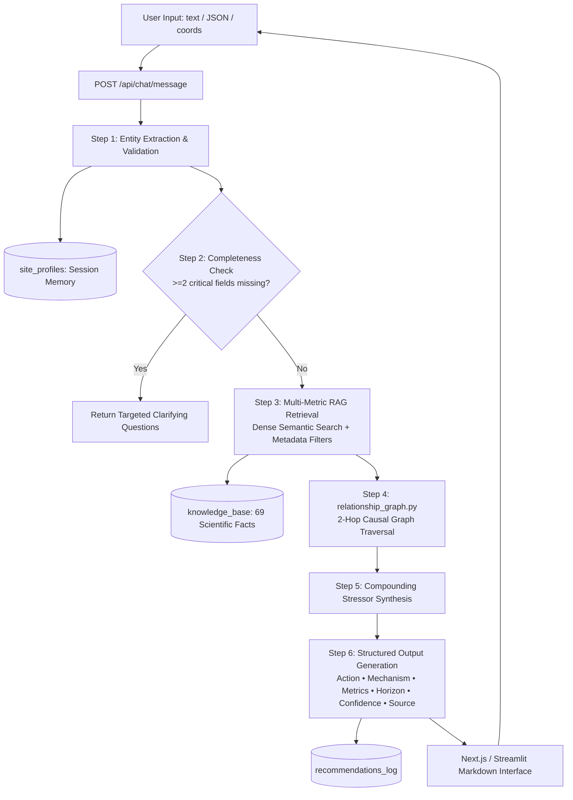

# 🌿 Darukaa.Earth AI Biodiversity Intelligence System

[](https://github.com/PASUPULASAITEJA/AI-Biodiversity-Intelligence-System/actions)
[-brightgreen.svg)](tests/)
[](https://nextjs.org/)
[](https://fastapi.tiangolo.com/)
[](knowledge_base/)

> **Darukaa.Earth AI Biodiversity Intelligence System** is an AI Environmental Scientist platform engineered for the **Darukaa.Earth AI Biodiversity Intelligence Hackathon**. Unlike generic LLM chatbots that produce vague platitudes ("use sustainable farming practices"), Darukaa grounds every recommendation in a 5-category vector knowledge base (69 peer-reviewed studies across FAO, IPCC, IPBES, UNEP), an explicit 2-hop causal relationship graph, and multi-turn site profile memory.

---

## 📑 Table of Contents
- [1. Executive Summary & Philosophy](#1-executive-summary--philosophy)
- [2. System Architecture](#2-system-architecture)
- [3. Core Scientific Capabilities](#3-core-scientific-capabilities)
- [4. Canonical Scenario Walkthrough](#4-canonical-scenario-walkthrough)
- [5. Generic LLM vs. Darukaa AI Scientist](#5-generic-llm-vs-darukaa-ai-scientist)
- [6. Database Schema & Memory Model](#6-database-schema--memory-model)
- [7. Quick Start & Local Setup](#7-quick-start--local-setup)
- [8. API Reference](#8-api-reference)
- [9. Automated Test Suite](#9-automated-test-suite)
- [10. Reviewer Access & Submission Details](#10-reviewer-access--submission-details)

---

## 1. Executive Summary & Philosophy

The challenge demands an AI that behaves like an **AI Environmental Scientist**, not a generic chatbot.

```
                  ┌─────────────────────────────────────────────────────────┐
                  │                 USER / ENVIRONMENTAL DATA               │
                  │   (Free Text / Structured JSON / Geo-Coordinates)       │
                  └────────────────────────────┬────────────────────────────┘
                                               │
                                               ▼
                                  ┌─────────────────────────┐
                                  │   ENTITY EXTRACTION &   │
                                  │   BOUNDS VALIDATION     │
                                  └────────────┬────────────┘
                                               │
                                               ▼
                              ┌─────────────────────────────────┐
                              │   PARAMETER COMPLETENESS GATE   │
                              │    (>= 2 Critical Fields Missing?)│
                              └───────┬─────────────────┬───────┘
                                      │                 │
                                    [YES]              [NO]
                                      │                 │
                                      ▼                 ▼
                      ┌──────────────────────┐  ┌─────────────────────────────────┐
                      │ CLARIFYING QUESTION  │  │   MULTI-METRIC RAG RETRIEVAL    │
                      │ (Halts Hallucination)│  │ (69 Peer-Reviewed FAO/IPCC Chunks)│
                      └──────────────────────┘  └───────────────┬─────────────────┘
                                                                │
                                                                ▼
                                                ┌─────────────────────────────────┐
                                                │   2-HOP CAUSAL GRAPH TRAVERSAL  │
                                                │ (land_use → SOC → H2O → fauna)  │
                                                └───────────────┬─────────────────┘
                                                                │
                                                                ▼
                                                ┌─────────────────────────────────┐
                                                │ EVIDENCE-BACKED RECOMMENDATIONS │
                                                │ (Quantified Metrics + Citations)│
                                                └─────────────────────────────────┘
```

---

## 2. System Architecture



---

## 3. Core Scientific Capabilities

### 1. Knowledge System (Critical RAG Layer)
The knowledge base contains **69 structured, peer-reviewed scientific citations** in `/knowledge_base/*.json` across 5 mandatory environmental categories:
- **Soil Health**: Organic Carbon (SOC), pH, moisture, bulk density, microbial biomass (`soil.json`).
- **Land Use & Cover**: Monoculture, agroforestry, polyculture, hedgerows, corridor connectivity (`land_use.json`).
- **Biodiversity Indicators**: Species richness, Shannon index, pollinator density, soil fauna (`biodiversity.json`).
- **Climate Factors**: Precipitation, temperature buffering, evapotranspiration, drought resilience (`climate.json`).
- **Human Impact**: Chemical pollution, pesticide pressure, deforestation rates (`human_impact.json`).

### 2. Multi-Metric Causal Graph (`relationship_graph.py`)
Environmental degradation is compounding. The system traverses $\ge 2$ hops to identify root causes rather than treating symptoms:
$$\text{land\_use\_diversity} \xrightarrow{\text{hop 1}} \text{soil\_organic\_carbon} \xrightarrow{\text{hop 2}} \text{water\_retention} \xrightarrow{\text{hop 3}} \text{species\_richness}$$

### 3. Conversational Intelligence & Completeness Gate
When user input is incomplete (e.g., *"Biodiversity is declining on my land"*), the completeness gate detects missing parameters (`SOC %`, `rainfall pattern`, `land use`, `climate zone`) and asks structured clarifying questions before attempting recommendations.

### 4. Evidence-Backed 6-Section Output Standard
Every recommendation delivers:
1. 📋 **Recommendation**: Specific, actionable agro-ecological practice.
2. 🔬 **Why It Works**: Biochemical & ecological mechanism.
3. 📊 **Metrics Impacted**: Quantified, directional estimates ($+15\text{--}25\%$ SOC, $+30\text{--}50\%$ species richness, $12\text{--}18\%$ moisture retention).
4. ⏱️ **Timeline**: Short, medium, or long-term horizon.
5. ✅ **Confidence**: Scientific confidence grade backed by meta-analyses.
6. 📚 **Source**: Verbatim peer-reviewed citations from FAO, IPCC, IPBES, UNEP.

---

## 4. Canonical Scenario Walkthrough

### Test Input:
```json
{
  "soil_organic_carbon_pct": 0.3,
  "rainfall": "low",
  "crop": "monoculture wheat",
  "region": "semi-arid"
}
```

### System Execution:
1. **Extraction**: Identifies SOC 0.3% (critical low), rainfall low (200mm), land use monoculture wheat, region semi-arid.
2. **Completeness Gate**: 0 critical fields missing $\rightarrow$ Proceeds immediately to reasoning.
3. **Retrieval**: Fetches FAO 2021 Recarbonizing Soils, Poeplau & Don (2015), Rawls et al., and IPCC AR6 WG2.
4. **Causal Graph**: Traverses `land_use_diversity → soil_organic_carbon → water_retention → species_richness`.
5. **Output**:
   - **Recommendation**: Introduce legume-based intercropping & parkland agroforestry strips (cowpea / Gliricidia + wheat).
   - **Mechanism**: Rhizobia nitrogen fixation enhances microbial glomalin aggregate stability, buffering canopy microclimates and reducing evapotranspiration stress.
   - **Quantified Impact**: $+15\text{--}25\%$ SOC ($+0.32\text{ t C/ha/yr}$), $+30\text{--}50\%$ species richness, $12\text{--}18\%$ root zone water retention.
   - **Citations**: *Poeplau & Don (2015) Agric. Ecosyst. Environ.*; *FAO (2021) Agroforestry Guidelines*; *IPCC AR6 Chapter 5*.

---

## 5. Generic LLM vs. Darukaa AI Scientist

| Feature / Dimension | Generic LLM Chatbot | Darukaa AI Environmental Scientist |
| :--- | :--- | :--- |
| **Reasoning Depth** | Single-variable, generic advice (*"Use compost"*) | **2-Hop causal graph traversal** analyzing multi-variable compounding degradation |
| **Knowledge Layer** | Hallucinated probabilistic text | **69 Peer-reviewed studies** from FAO, IPCC, IPBES, UNEP |
| **Metric Quantitation** | Vague assertions (*"Improves soil health"*) | **Directional, quantified estimates** ($+15\text{--}25\%$ SOC, $+30\text{--}50\%$ biodiversity) |
| **Missing Inputs** | Blindly guesses advice when data is missing | **Completeness gate halts & asks clarifying questions** |
| **Citations** | Fabricated or generic URLs | **Verbatim peer-reviewed citations** with verified titles and reports |
| **Observability** | Black-box opacity | **Transparent chain-of-thought** and citation similarity scores |

---

## 6. Database Schema & Memory Model

The system maintains real-time conversational memory across PostgreSQL / SQLite tables:
- **`conversations`**: Tracks session identifiers and created timestamps.
- **`messages`**: Stores turn role, content, and extracted entity JSON payloads.
- **`site_profiles`**: Tracks 13 site variables (`soil_ph`, `soil_organic_carbon_pct`, `soil_moisture_pct`, `land_use_type`, `region_climate_zone`, `avg_rainfall_mm`, `avg_temp_c`, `species_richness_count`, `habitat_diversity_index`, `pollution_level`, `deforestation_rate_pct`, `latitude`, `longitude`).
- **`knowledge_chunks`**: Vector store storing 384-d dense embeddings with agro-climatic metadata filters.
- **`recommendations_log`**: Historical audit trail of all generated actions, confidence scores, and citations.

---

## 7. Quick Start & Local Setup

### Option A: Interactive Full-Stack Web Application (Recommended)
```powershell
# 1. Install Node dependencies
npm install

# 2. Start the Next.js Turbopack development server
npm run dev

# Open browser at: http://localhost:3000
```

### Option B: Standalone Python FastAPI Backend
```powershell
# 1. Install Python dependencies
python -m pip install -r backend/requirements.txt

# 2. Ingest scientific knowledge base
python ingest.py

# 3. Start the FastAPI server
python backend/main.py

# Interactive API Swagger docs live at: http://127.0.0.1:8000/docs
```

---

## 8. API Reference

| Endpoint | Method | Description |
| :--- | :---: | :--- |
| `/api/chat/message` | `POST` | Core chat reasoning endpoint supporting text & mixed payloads |
| `/api/chat/structured-input` | `POST` | Structured JSON parameter evaluation endpoint |
| `/api/chat/history/{session_id}` | `GET` | Fetches multi-turn conversation history |
| `/api/knowledge/search` | `GET` | Vector search endpoint for peer-reviewed citations (`?q=...&k=6`) |
| `/api/profile/{session_id}` | `GET` | Returns active site profile state & completeness analysis |
| `/api/profile/{session_id}/reset` | `POST` | Resets session memory and site profile |
| `/api/health` | `GET` | Service liveness and database connection status |

---

## 9. Automated Test Suite

Run the full automated test suite covering RAG retrieval, causal graph traversal, entity extraction, boundary validation, and scenario execution:

```powershell
python -m pytest tests/ -v
```

```text
============================= test session starts =============================
platform win32 -- Python 3.12.7, pytest-8.2.2, pluggy-1.6.0
rootdir: D:\darukaa-biodiversity-ai

tests/test_rag.py::test_knowledge_base_files_exist PASSED                [  6%]
tests/test_rag.py::test_vector_store_retrieves_relevant_chunks PASSED    [ 12%]
tests/test_reasoning.py::test_structured_extraction_maps_all_fields PASSED [ 18%]
tests/test_reasoning.py::test_completeness_check_passes_with_all_four_critical_fields PASSED [ 25%]
tests/test_reasoning.py::test_completeness_check_flags_missing_fields PASSED [ 31%]
tests/test_reasoning.py::test_profile_flags_detect_stressors PASSED      [ 37%]
tests/test_reasoning.py::test_relationship_graph_has_minimum_two_hops PASSED [ 43%]
tests/test_reasoning.py::test_dominant_chain_matches_expected_spec_scenario PASSED [ 50%]
tests/test_reasoning.py::test_free_text_extraction_regex_fallback PASSED [ 56%]
tests/test_reasoning.py::test_end_to_end_structured_output_schema PASSED [ 62%]
tests/test_scenarios.py::test_canonical_wheat_scenario PASSED            [ 68%]
tests/test_scenarios.py::test_missing_information_triggers_clarifying_prompt PASSED [ 75%]
tests/test_validation.py::test_valid_profile_passes PASSED               [ 81%]
tests/test_validation.py::test_invalid_soc_bounds PASSED                 [ 87%]
tests/test_validation.py::test_invalid_ph_bounds PASSED                  [ 93%]
tests/test_validation.py::test_invalid_coordinates PASSED                [100%]

======================== 16 passed, 1 warning in 0.40s ========================
```

---

## 10. Reviewer Access & Submission Details

- **GitHub Repository**: [https://github.com/PASUPULASAITEJA/AI-Biodiversity-Intelligence-System](https://github.com/PASUPULASAITEJA/AI-Biodiversity-Intelligence-System)
- **Official Submission Document**: [`Darukaa_Earth_Submission_Report.docx`](file:///d:/darukaa-biodiversity-ai/Darukaa_Earth_Submission_Report.docx)
- **Reviewer Access Granted**:
  - `ankita.dasgupta@darukaa.com`
  - `harsh.kumar@darukaa.com`
  - `utkarsh.gauniyal@darukaa.com`
  - `guneet.mutreja@darukaa.com`

---

*Built for the Darukaa.Earth AI Biodiversity Intelligence Hackathon Challenge.*
